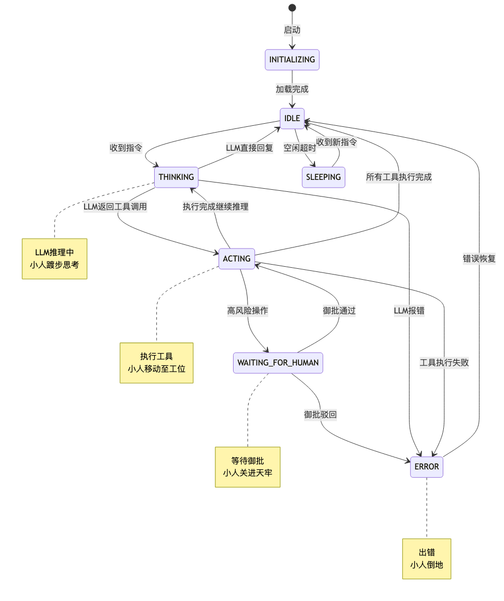
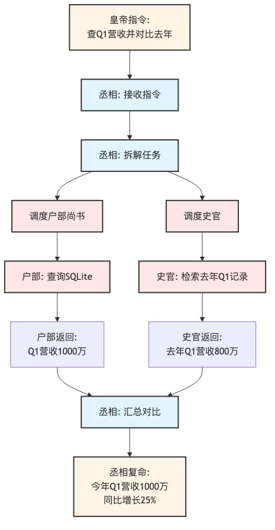
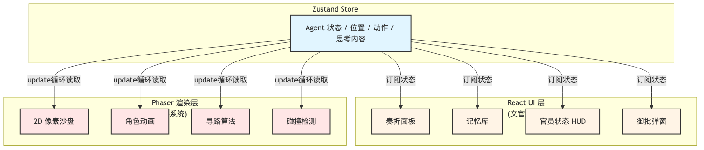
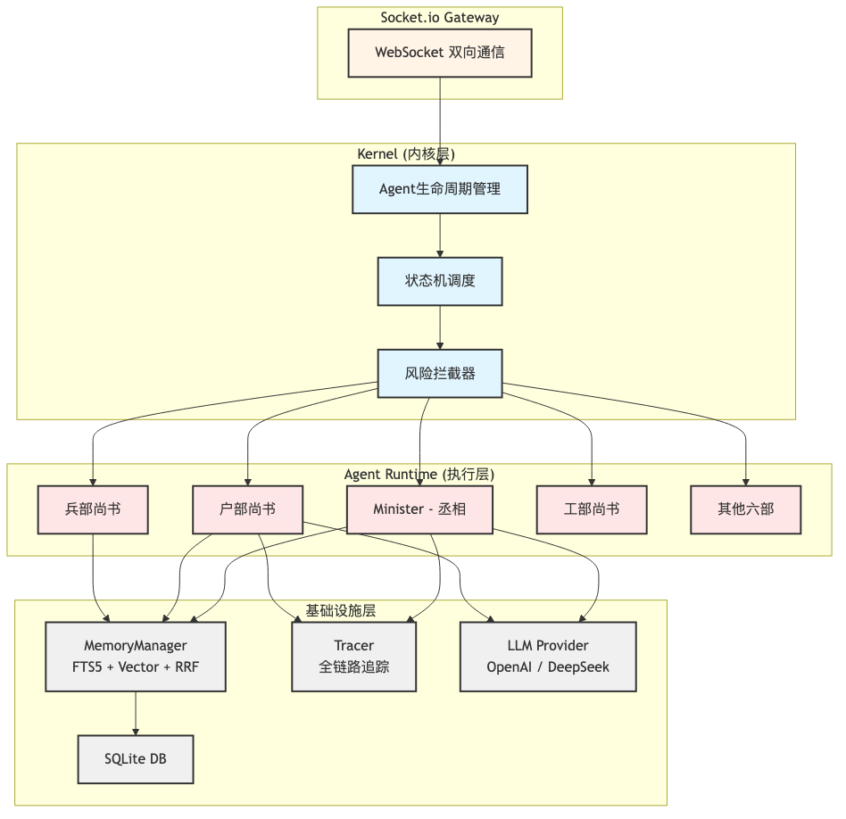

# 我写了个系统，每天上朝批奏折：把 Agent 做成「文武百官」是什么体验

> 当小人被关进天牢的那一刻，就是朕决定掏钱的那一刻。

## 写在前面

先说结论：**当你用「拟圣旨」的方式给 Agent 下指令，看着丞相带着六部尚书在 2D 像素宫殿里跑来跑去给你办差——这玩意儿比你想象的更有成就感。**

我叫它 [Syntropy（太和）](https://github.com/zabr1314/Syntropy)，一个基于**古代朝廷**隐喻的**可视化多智能体操作系统**。但不是那种换个皮就完事的「国潮包装」，而是真的把 Agent 的执行过程「具象化」了：

- Agent 不再是日志里的一串 `tool_call_pending`，而是**坐在工位上的像素小人**
- 任务调度不再是抽象的 Orchestrator，而是**丞相（Minister）在廷议上发号施令**
- 风险拦截不再是冷冰冰的 `await human_approval()`，而是**把 Agent 关进天牢，等你御批**

<!-- 📸 配图1：系统预览图 - 使用 docs/assets/preview.png -->


你可能会问：**为什么要搞这么复杂？直接写代码不行吗？**

因为现有的 Multi-Agent 框架（LangChain、AutoGen、CrewAI……）有一个共同的问题：**它们是黑盒**。你能看见输入和输出，但中间的思考、决策、调度、执行，全在一团混沌的日志里。你调了半天 prompt，还是不知道 Agent 卡在哪一步。

所以我的思路很简单：**既然 Agent 的执行过程看不见，那就让它「看得见」。**

这篇文章会拆解这套系统的技术架构，但不会堆砌术语。咱们边「上朝」边聊：怎么把状态机映射成像素动画、怎么实现前后端实时同步、怎么设计「御批」机制，以及——**为什么「当皇帝」这个隐喻，反而让 Agent 系统更好用了。**

---

## 1. 问题：Agent 系统的「三大弊政」

在动手之前，我先总结了当前 Multi-Agent 系统的三个「弊政」：

### 1.1 黑盒化（Black Box）——「爱卿，你到底在想什么？」

Agent 的 Chain-of-Thought（思维链）是一串嵌套的 JSON，工具调用是一条条 log 记录。你很难从这些信息里快速判断：

- Agent 现在在做什么？是在思考，还是在等你审批？
- 它在等谁？丞相在等户部尚书查账，还是兵部尚书在调兵？
- 它卡在哪一步了？是 LLM 没返回，还是工具调用超时？
- 它的决策依据是什么？为什么它选择了这个方案而不是另一个？

**现状**：你只能盯着终端滚屏的日志，祈祷 Agent 别卡死。

### 1.2 失控风险（Uncontrollable）——「爱卿，这奏折朕没批你就敢执行？」

Agent 自主调用工具是一件很危险的事。删除文件、转账、调用外部 API —— 这些操作一旦失控，后果不可逆。

现有的「Human-in-the-loop」方案要么是简单的 `input()` 阻塞（体验极差），要么需要入侵式地修改整条执行链路（开发成本高）。

**现状**：你要么相信 Agent 不会乱来，要么就得自己写一套审核机制。

### 1.3 记忆遗忘（Amnesia）——「爱卿，昨天说的事你怎么忘了？」

大多数 Agent 框架的记忆系统基于关键词匹配或纯向量检索。关键词匹配漏掉语义相关的信息，纯向量检索又容易在专有名词上翻车。长对话场景下，Agent 往往会「忘记」几轮之前说过的关键信息。

**现状**：你只能不断「提示」Agent，把上下文塞给它，直到 Token 爆掉。

---

## 2. 方案：把 Agent 变成「可观测的臣子」

Syntropy 的核心思路只有一句话：

> **所见即所思（What you see is what they think）。**

具体拆解为三个「治国方略」：

### 2.1 可视化运行时（Visualized Runtime）——「爱卿们，都动起来」

Agent 的内部状态机（`THINKING`、`ACTING`、`WAITING`、`ERROR`）不只在日志里打印，而是**实时映射为 2D 像素小人的行为动画**：

- **THINKING** → 小人在原地踱步，头顶冒出气泡（正在思考）
- **ACTING** → 小人移动到对应的「工位」（户部查账、兵部调兵、工部造器械……）
- **WAITING_FOR_HUMAN** → 小人被「关进天牢」，等待你的御批
- **ERROR** → 小人倒地，头顶冒叉（出错了，得查日志）

这套映射让 Agent 的执行状态变得**一眼可见**。你不再需要翻几百行日志，只需要看一眼沙盘，就知道哪个 Agent 卡住了、它在干什么、它在等谁。

### 2.2 内核级状态机（Kernel-Level State Machine）——「朝堂规矩，不可乱」

后端 Agent 的生命周期被标准化为一个有限状态机（FSM）：

<!-- 📸 配图2：Agent状态机 - 使用 天命系统配图/agent-state-machine.png -->


这个 FSM 是「内核级」的，意味着：

- **LLM 推理**（Reasoning）和**工具执行**（Execution）完全解耦
- 每个状态的进入和离开都会触发标准化的事件（可观测）
- 风险拦截、记忆压缩、日志追踪都可以作为「状态钩子」无痕插入

**简单说**：Agent 不再是「自由发挥」，而是按「朝堂规矩」办事。

### 2.3 人机协同「御批」协议（Human-in-the-loop）——「这道奏折，朕要亲自批」

每个工具调用都有 `riskLevel`（low / medium / high）。当 Agent 试图执行高风险操作时：

1. 内核挂起当前执行流，状态切换为 `WAITING_FOR_HUMAN`
2. 前端收到 `approval_request` 事件，弹出「御批」弹窗
3. 用户点击「准奏」或「驳回」，通过 Socket 发回指令
4. 内核恢复执行流（或回滚）

这套机制让「人审」不再是事后补救，而是**执行流程的有机组成部分**。

---

## 3. 核心功能：奏折阁与决策树

讲完架构，聊聊实际用起来是什么感觉。

### 3.1 奏折阁（Imperial Archives）——「每道圣旨，都有迹可循」

在 Syntropy 里，每一次用户指令都被封装为一份**「奏折」**。奏折阁是系统的任务管理中心，完整记录了从**拟旨 → 受理 → 分发 → 复命**的全过程。

**奏折的核心特性**：

- **折叠/展开**：每份奏折默认折叠，仅展示摘要（如"查Q1税收"）；展开后可查看完整的对话链路与决策树
- **多视角叙事**：左侧展示百官的回复与思考过程，右侧展示皇帝（用户）的指令，清晰还原对话脉络
- **状态追踪**：每份奏折都有明确的状态标签（待处理 / 进行中 / 已完成 / 已驳回），方便追溯

<!-- 📸 配图3：奏折阁截图 - 建议截一张奏折展开图，或复用 preview.png -->


### 3.2 决策树可视化——「丞相的思考，一目了然」

当丞相收到一道复杂指令（如「查一下上季度的营收，并对比去年同期」），它不会直接给出答案，而是会拆解任务、调度六部、汇总结果。整个过程形成一棵**决策树**：

<!-- 📸 配图4：决策树 - 使用 天命系统配图/decision-tree.png -->


在奏折阁中，这棵决策树以**可视化流程图**的形式呈现。你可以清楚地看到：

- 丞相调度了哪些 Agent
- 每个 Agent 执行了什么操作
- 每一步的输入和输出是什么
- 如果某一步出错，具体卡在哪里

**这对调试和优化至关重要**。你不再需要猜"Agent 为什么没按我的预期做事"，而是可以直接看到它的决策路径，找出问题所在。

### 3.3 记忆库（Memory Vault）——「史官的起居注」

记忆库展示 Agent 主动保存的重要信息（个人偏好、项目决策、关键事实），支持：

- **搜索与过滤**：按关键词搜索，或按类别（personal / preference / project / decision）筛选
- **在线编辑**：直接在前端编辑或删除记忆条目，实时同步到后端
- **语义分类**：LLM 根据上下文自动选择记忆类别，无需人工标注

---

## 4. 技术实现：朝堂是如何运转的

### 4.1 前端：React + Phaser 的「双引擎」架构

前端是 Syntropy 最复杂的部分。我们需要同时处理两类需求：

- **UI 层**：奏折面板、记忆库、官员状态 HUD、御批弹窗……这些是典型的 React 组件
- **渲染层**：2D 像素沙盘、角色动画、寻路、碰撞检测……这些是游戏引擎的领域

我们的方案是 **React-Phaser Bridge**：

<!-- 📸 配图5：前端架构 - 使用 天命系统配图/frontend-architecture.png -->


- **Zustand** 作为单一数据源（Single Source of Truth），存储所有 Agent 的状态
- **React** 组件订阅 Zustand Store，渲染 UI 面板
- **Phaser 3** 在 `update()` 循环中读取 Store，同步小人动画

这套架构的好处是：**UI 和渲染完全解耦**。React 不用关心像素坐标，Phaser 不用关心业务逻辑，两者通过 Zustand 的状态桥接。

#### 关键代码片段：状态同步

```typescript
// store/agentStore.ts
export const useAgentStore = create<AgentStore>((set) => ({
  agents: {},
  updateAgent: (id, updates) =>
    set((state) => ({
      agents: {
        ...state.agents,
        [id]: { ...state.agents[id], ...updates },
      },
    })),
}));
```

```typescript
// game/MainScene.ts
export class MainScene extends Phaser.Scene {
  update() {
    const agents = useAgentStore.getState().agents;
    Object.values(agents).forEach((agent) => {
      const sprite = this.sprites[agent.id];
      if (sprite) {
        sprite.updateState(agent.status, agent.targetPosition);
      }
    });
  }
}
```

### 4.2 后端：自研 Agent 框架

Syntropy 的后端完全自研，不依赖任何现有的 Agent 框架（LangChain、AutoGen 等）。原因很简单：**现有框架的状态机模型和我们需要的不完全匹配**。

**后端整体架构**：

<!-- 📸 配图6：后端架构 - 使用 天命系统配图/backend-architecture.png -->


后端核心模块：

| 模块 | 职责 |
|------|------|
| **Kernel** | Agent 生命周期管理，状态机调度 |
| **Agent** | 单个 Agent 的 LLM 调用、工具执行、状态流转 |
| **LLM Provider** | 统一的 LLM API 抽象（支持 OpenAI / DeepSeek） |
| **MemoryManager** | 记忆存储与检索（FTS5 + Vector + RRF） |
| **SocketGateway** | 前后端实时通信 |
| **Tracer** | 全链路追踪与结构化日志 |

#### Agent 核心状态机

```typescript
// server/core/Agent.ts
class Agent {
  private state: AgentState = 'IDLE';

  async processMessage(message: string) {
    this.setState('THINKING');
    const response = await this.llm.chat(message);
    
    if (response.toolCalls) {
      for (const toolCall of response.toolCalls) {
        const risk = this.assessRisk(toolCall);
        if (risk === 'high') {
          this.setState('WAITING_FOR_HUMAN');
          await this.waitForApproval(toolCall);
        }
        await this.executeTool(toolCall);
      }
    }
    
    this.setState('IDLE');
    return response.content;
  }
}
```

### 4.3 记忆系统：RRF 混合检索引擎

Syntropy 的记忆系统不是纯向量检索，而是**三位一体**的混合架构：

1. **SQLite**：结构化元数据（时间、类别、Agent ID）
2. **FTS5**：全文倒排索引，精准匹配关键词
3. **Vector**：语义向量，模糊语义检索

检索时，我们使用 **Reciprocal Rank Fusion (RRF)** 算法合并 FTS 和 Vector 的结果：

```
RRF_score = Σ (1 / (k + rank_i))
```

其中 `k` 是平滑常数（通常取 60），`rank_i` 是某条记忆在第 `i` 个检索引擎中的排名。

#### 为什么需要 RRF？

- **关键词场景**：用户问「昨天的税收是多少」，FTS 能精准命中包含"税收"的记录，Vector 可能因为语义漂移而漏掉
- **语义场景**：用户问「最近有什么异常吗」，FTS 因为没有一个明确的关键词而失效，Vector 能理解"异常"的语义

RRF 让两者互补，召回率显著提升。

#### 记忆压缩（Memory Compression）

当 Agent 进入 `SLEEPING` 状态时，系统自动调用 LLM 对当日未处理的对话进行摘要，生成 `daily_summary` 并持久化。这解决了长对话场景下的 Token 溢出问题。

```typescript
// server/runtime/MemoryManager.ts
async compressMemories(agentId: string, conversations: Conversation[]) {
  const summary = await this.llm.chat(`
    请对以下对话进行摘要，提取关键决策和待办事项：
    ${conversations.map(c => c.content).join('\n')}
  `);
  
  await this.db.insert('memories', {
    agentId,
    type: 'daily_summary',
    content: summary,
    timestamp: Date.now(),
  });
}
```

### 4.4 全链路追踪（Tracer）

每个用户指令生成唯一的 `traceId`，贯穿 Agent 调度、工具调用、LLM 推理全流程。Tracer 记录 8 种诊断事件：

- `agent.turn`：Agent 开始处理一轮对话
- `tool.call`：工具调用
- `model.usage`：LLM 调用及 Token 消耗
- `dispatch`：任务分发
- `approval.wait`：等待御批
- `approval.done`：御批完成
- `agent.stuck`：Agent 卡死检测（3 分钟无响应自动告警）
- `memory.save`：记忆保存

所有事件自动脱敏（截断 API Key 等敏感信息），便于性能分析和故障排查。

---

## 5. 架构反思

### 5.1 为什么选 Phaser 而不是 Canvas / SVG？

Phaser 是一个专业的 2D 游戏引擎，提供了完整的**场景管理、精灵动画、碰撞检测、寻路算法**。如果用 Canvas 手写，这些都要从零实现；如果用 SVG，大量 DOM 元素会导致性能问题。

Phaser 的 WebGL 渲染让我们可以轻松实现：
- 像素小人的平滑移动动画
- 头顶气泡的动态效果
- 大规模 Agent 同时活动时的性能保障

### 5.2 为什么不直接用 LangChain / AutoGen？

LangChain 和 AutoGen 的状态机模型是「扁平」的：Agent 顺序执行 Thought → Action → Observation。但我们需要的是**内核级**的状态机，能够：

- 在任意时刻挂起执行流（御批拦截）
- 在任意时刻注入新状态（外部干预）
- 标准化所有状态转换事件（可观测性）

现有的框架很难在不破坏封装的前提下实现这些需求。

### 5.3 视觉隐喻的取舍

「古代朝廷」这套视觉系统是一把双刃剑：

**优点**：
- 降低了多 Agent 系统的认知门槛，非技术用户也能理解「丞相调度六部」的概念
- 增强了产品的辨识度和传播性

**缺点**：
- 增加了设计和开发成本（像素素材、动画、场景布局）
- 对部分技术用户来说可能显得「花哨」

我们的判断是：**可视化的核心价值在于降低认知负担，视觉隐喻只是手段**。如果换一套视觉系统（如太空站、工厂流水线），只要核心架构不变，价值依然存在。

---

## 6. 开源与未来

Syntropy 目前处于 Beta 阶段，代码已开源：[GitHub - zabr1314/Syntropy](https://github.com/zabr1314/Syntropy)

未来规划：
- **技能市场**：允许开发者为 Agent 开发自定义技能（类似 VSCode 插件）
- **多场景模板**：除了「朝廷」，提供「太空站」「工厂」等可选视觉主题
- **Agent 编排可视化**：拖拽式构建多 Agent 协作链路
- **分布式部署**：支持将不同 Agent 部署在不同节点上

---

## 7. 结语：当皇帝的一天

Syntropy 本质上是一次**将 AI 黑盒具象化**的尝试。我们相信：

> **当 Agent 的执行过程变得可见、可交互、可干预，多智能体系统才能真正从实验室走向生产环境。**

但除此之外，它还有一个不那么「技术」的价值：**它让管理 Agent 变成了一件有趣的事**。

每天早上打开系统，看到丞相已经在廷议上等你，六部尚书各就各位。你拟定一道圣旨，看着小人们在宫殿里跑来跑去办差。有时候他们会卡住，有时候他们会犯错，有时候他们会把奏折递到你面前等你御批——**这一刻，你不是在 debug，你是在当皇帝。**

如果你对这套架构感兴趣，或者有自己的看法，欢迎在 GitHub 上交流。

---

**相关资源**：
- 项目地址：[https://github.com/zabr1314/Syntropy](https://github.com/zabr1314/Syntropy)
- 技术文档：[docs/ARCHITECTURE.md](https://github.com/zabr1314/Syntropy/blob/main/docs/ARCHITECTURE.md)
- 快速启动：复制 `.env.example` 配置 API Key，`node server/index.js` + `npm run dev` 即可「上朝」
